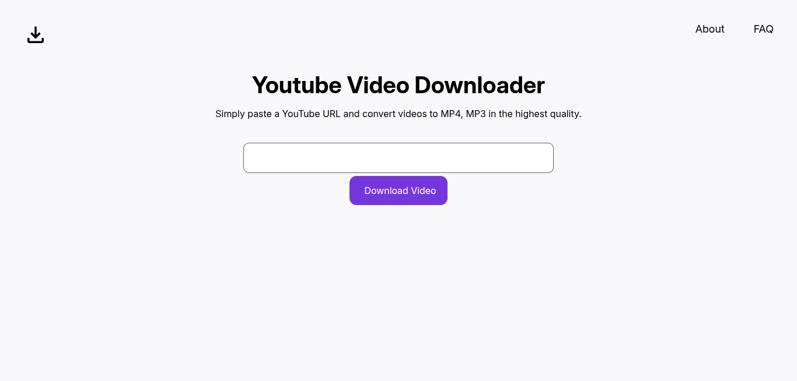
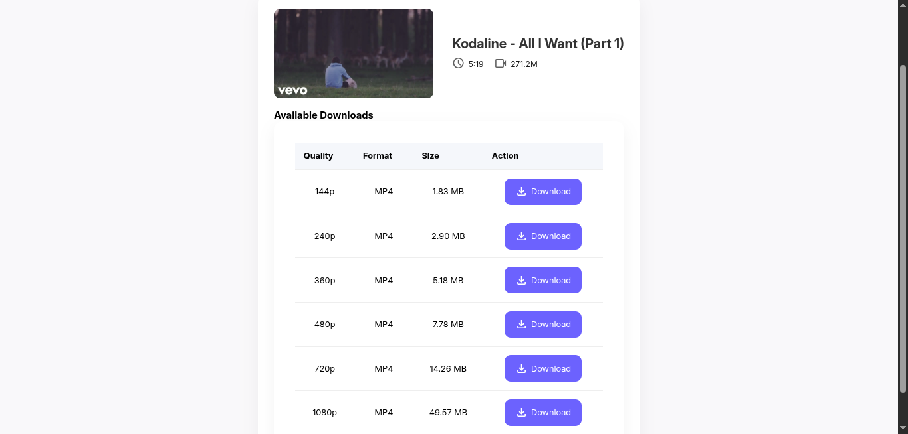

# Youtube Video Downloader

A fullstack YouTube video downloader built with **ReactJS** (frontend) and **NodeJS + Express** (backend), using the `yt-dlp` tool to download the videos with given link


# Demo



# Tech Stack
Uses React, Node, Express, and yt-dlp for downloading videos

# How to use?
### 1. Clone the Repository
```bash 
git clone https://github.com/ash-dodek/Youtube-Video-Downloader.git
cd Youtube-Video-Downloader
```

### 2. Install Dependencies
- Frontend
```bash 
npm i
```
- Backend
```bash
pip install yt-dlp
```
 then
 ```bash 
cd api
npm i
```
 In the root directory, create a `.env` file, in the file add a field name `VITE_API_URL`, which stores the url of the hostedb ackend, in this case it is `http://localhost:3000`

 Therefore we add `VITE_API_URL = http://localhost:3000`

### 3. Start the App
- In api folder
Start the server by `nodemon`
- Inside the outer folder, run `npm run dev`

This will start the website on `http://localhost:5173/`, and the backend on `http://localhost:3000/`